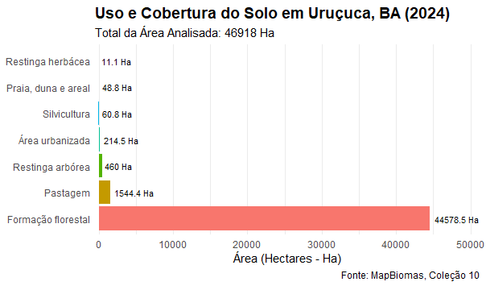
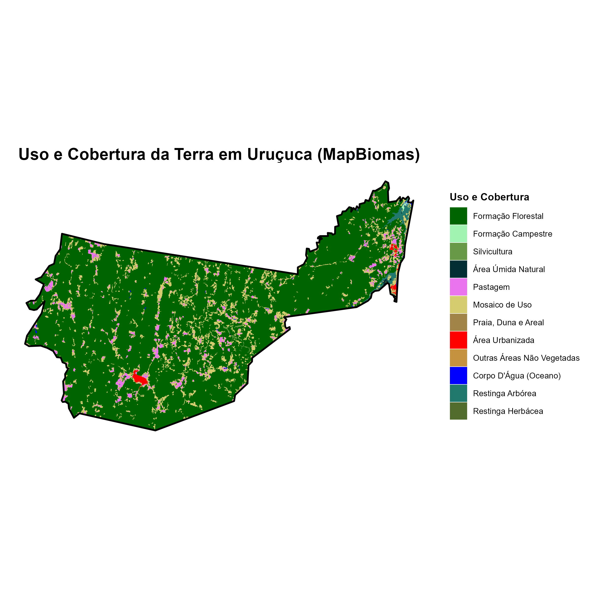
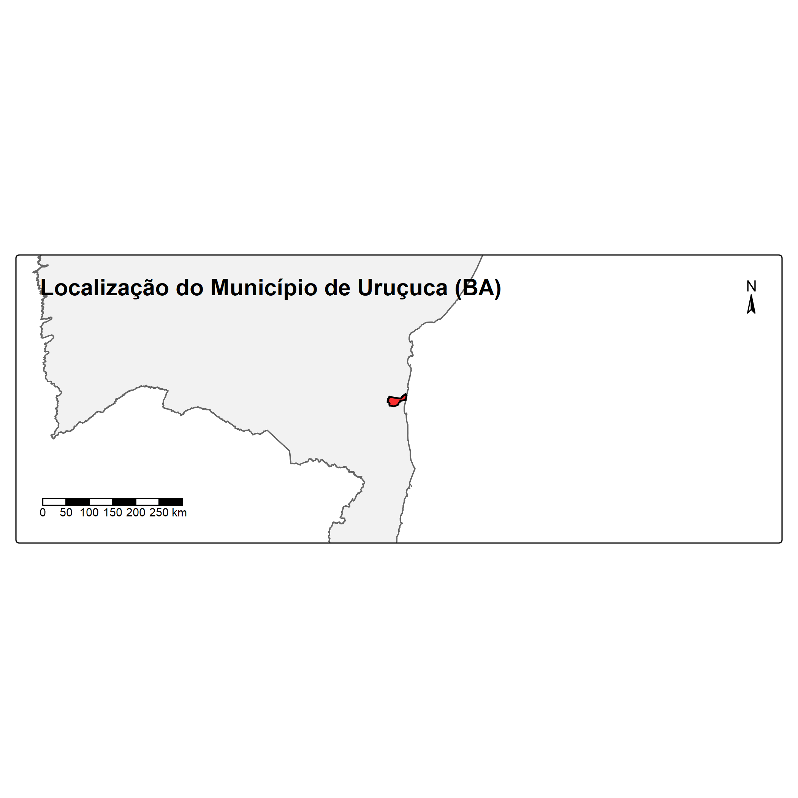

---

title: "Relatório de Uso e Cobertura do Solo"
subtitle: "Análise Geoespacial do Município de Uruçuca (BA)"
author: "Regina Guimaraes silva"
format: html
editor: visual
---

## Introdução 

Este relatório apresenta os resultados da análise de uso e cobertura do solo para o município de Uruçuca, no estado da Bahia, com base nos dados geoespaciais da Coleção 10 do projeto MapBiomas. O trabalho inclui o processamento de dados raster, cálculo de área por classe e visualização cartográfica dos resultados.O Objetivo do trabalho é analisar a cobertura de uso do solo no múnicipio no ano de 2024 e identificar a proporção e organaização espacial das diferentes unidades de paisagem para o muncípio.

## Metodologia

O processamento geoespacial foi realizado utilizando a linguagem R e os pacotes especializados sf (vetor), terra (raster) e tmap (cartografia). As principais etapas incluíram:

Recorte Espacial: O raster de uso do solo do MapBiomas foi recortado utilizando o limite vetorial do município de Uruçuca.

Cálculo de Área: A frequência de pixels foi contada para cada classe de uso do solo, e as contagens foram convertidas em Hectares (Ha).

Visualização: Geração de mapas temáticos (raster e vetor) e um gráfico de barras.

## Resultados 

1.  Visualização gráfica - o gráfico de barras mostra visualmente a predominância das classes de uso do solo:

    

2.  Mapa raster de uso e cobertura do solo - Este mapa apresenta a distribuição espacial das classes de uso e cobertura do solo no município de Uruçuca:

    

3.  Mapa vetorial de contexto do município de Uruçuca no estado da Bahia - Este mapa mostra o vetor de demarcação da área do município de Uruçuca, posicionando o município no Estado da Bahia:

    

## Conclusão 

A análise revela que a Formação Florestal é a classe predominante, respondendo por 92% da área do município, conforme apesentado no gáfico 1. Utilizar ferramentas geoespaciais para conseguir informações atuais sobre as classes de uso e cobertura, bem como as proporções fornecem informações valiosas para futuras ações de planejamento e conservação.
